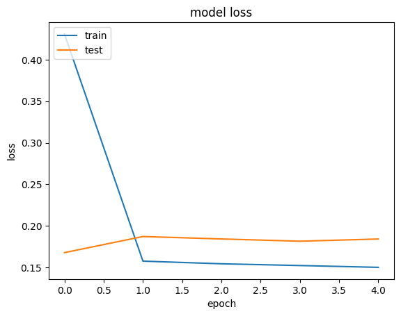
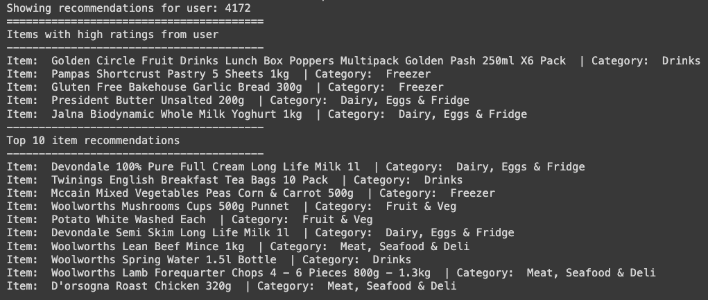
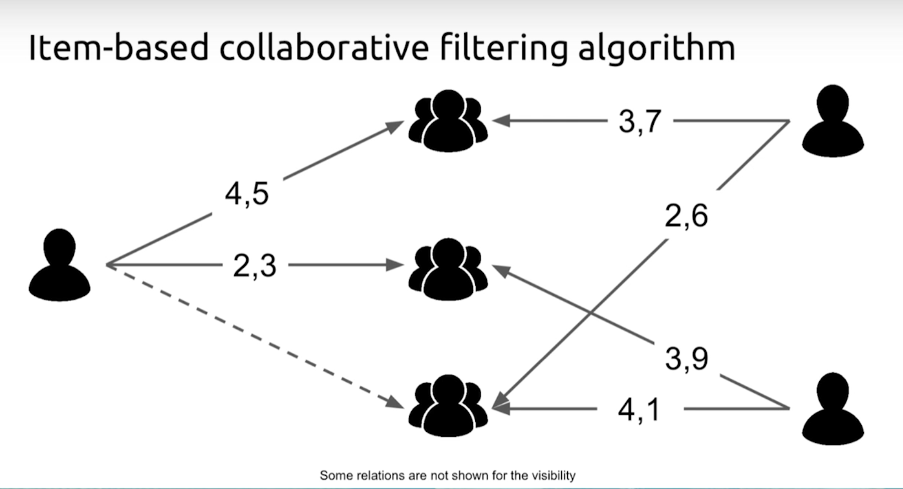

# Machine Learning Collaborative Filtering for Recommendations

This project is to use machine learning to perform collaborative filtering and generate recommendation for online grocery buyer.

<!-- PROJECT SHIELDS -->
[![MIT License][license-shield]][license-url]
[![LinkedIn][linkedin-shield]][linkedin-url]

<!-- PROJECT Image -->
 

  

<!-- ABOUT THE PROJECT -->
## About The Project

Machine learning is widely used to generate item recommendations in various applications such as e-commerce, content platforms, and personalized marketing. This service is now became the core competitive strength of many online business, for example, Netflix and Amazon. 

In this project we will construct an item recommender for an online shopping app. we will be using one of the popular machine learning technique called Collaborative filtering. The application will generate personalized recommendations by leveraging the preferences and behavior of similar users. The underlying idea behind collaborative filtering is that users who have shown similar preferences in the past are likely to have similar preferences in the future.

Collaborative filtering could also implemented in deep learning Model but this project we will be using the machine learning technique to achieve the goal.

### Built With

* Python 3.6
* numpy
* Pandas
* keras
* matplotlib

(<a href="#readme-top">back to top</a>)

<!-- GETTING STARTED -->
## Getting Started

1. Setup your GPU running machine locally or on the cloud platform
2. Install IPython
3. Clone the git repository
4. Execute the ipython script file in the "code" folder

### Prerequisites

* Basic understanding of python
* Basic knowledge of running python script in IPython environment
* Basic knowledge of database query
* Basic knowledge of machine learning program structure

### Data Source

This project is exported from one of my previous projects which was database based and there is no way to simply export the sample data then use the dataset file as the data source.

In order to run the provided script you will need to install MySQL in your local machine or in the cloud. Then create a few tables according to the provided data dictionary and insert sample records to it. The other way is to modify the script for importing your own data source. 

For creating the database to run the provided script, please refer to the documents in "data-source" folder for this project used database schema.

(<a href="#readme-top">back to top</a>)

<!-- Script Work Flow Description -->
## IPython Script Work Flow Description

The script will execute below steps sequencially

1. Install database connector
2. Import libraries
3. Connect to database
4. Recalculating ITEM_RATING table by the latest USER_ORDER records
5. Retrieve recalculated item rating result from database
6. Preprocessing data - encode users and items as integer indices
7. Extract min and max ratings to be used to normalize the ratings
8. Prepare training and validation data
9. Using a random seed of 42 to ensure the same order is obtained each time the code is run
10. Normalize the targets between 0 and 1. Makes it easy to train
11. Assuming training on 90% of the data and validating on 10%
12. Create the model with embedding layer - embed both users and items in to 50-dimensional vectors
13. Train the model based on the data split

  

15. Store model fitting result in a variable
16. Retrieve ITEM data from Database
17. Check recommendations generated by the system

  

(<a href="#readme-top">back to top</a>)

<!-- Key Concepts -->
## Key Concepts

  

### Collaborative Filtering

Collaborative filtering is a popular technique used in recommendation systems to generate personalized recommendations by leveraging the preferences and behavior of similar users. The underlying idea behind collaborative filtering is that users who have shown similar preferences in the past are likely to have similar preferences in the future.

There are two main types of collaborative filtering:

#### 1. User-Based Collaborative Filtering

* User-based collaborative filtering recommends items to a target user based on the preferences of other users who are similar to that user.
* The similarity between users is computed based on their past interactions with items. Common similarity measures include cosine similarity, Pearson correlation coefficient, and Jaccard similarity.
* To generate recommendations for a target user, the algorithm identifies a set of similar users (neighbors) and aggregates their preferences for items that the target user has not interacted with.
* Items with high aggregated ratings from similar users are recommended to the target user.

#### 2. Item-Based Collaborative Filtering

* Item-based collaborative filtering recommends items to a target user based on the similarity between items.
* The similarity between items is computed based on the preferences of users who have interacted with both items. Common similarity measures include cosine similarity and Pearson correlation coefficient.
* To generate recommendations for a target user, the algorithm identifies items that the user has already interacted with and finds similar items based on their past interactions with other users.
* Items similar to those already interacted with by the target user are recommended.

Collaborative filtering does not require explicit item metadata or user profiles. Instead, it relies solely on user-item interaction data, such as ratings, clicks, purchases, or other forms of feedback. It can handle large and sparse datasets and is capable of capturing complex user preferences and patterns.

(<a href="#readme-top">back to top</a>)

<!-- Design Explanation -->
## Design Explanation

### Item rating

Due to the limited resources on producing the source data, the item rating from customers is generated by the system automatically by counting the number of the item bought by each customer. This is the work around to fill up the customer rating in limited time and resources. In the production environment a rating system should be set up and real item rating data should be used.

(<a href="#readme-top">back to top</a>)

<!-- LICENSE -->
## License

Distributed under the MIT License. See `LICENSE.txt` for more information.

(<a href="#readme-top">back to top</a>)

<!-- CONTACT -->
## Contact

Oscar Lee 
Email: mail.oscar.lee@gmail.com 
LinkedIn: [https://www.linkedin.com/in/oscarlee1](https://www.linkedin.com/in/oscarlee1) 

(<a href="#readme-top">back to top</a>)

<!-- MARKDOWN LINKS & IMAGES -->
[license-shield]: https://img.shields.io/github/license/othneildrew/Best-README-Template.svg?style=for-the-badge
[license-url]: LICENSE
[linkedin-shield]: https://img.shields.io/badge/-LinkedIn-black.svg?style=for-the-badge&logo=linkedin&colorB=555
[linkedin-url]: https://www.linkedin.com/in/oscarlee1
[Next.js]: https://img.shields.io/badge/next.js-000000?style=for-the-badge&logo=nextdotjs&logoColor=white
[Next-url]: https://nextjs.org/
[React.js]: https://img.shields.io/badge/React-20232A?style=for-the-badge&logo=react&logoColor=61DAFB
[React-url]: https://reactjs.org/
[Vue.js]: https://img.shields.io/badge/Vue.js-35495E?style=for-the-badge&logo=vuedotjs&logoColor=4FC08D
[Vue-url]: https://vuejs.org/
[Angular.io]: https://img.shields.io/badge/Angular-DD0031?style=for-the-badge&logo=angular&logoColor=white
[Angular-url]: https://angular.io/
[Svelte.dev]: https://img.shields.io/badge/Svelte-4A4A55?style=for-the-badge&logo=svelte&logoColor=FF3E00
[Svelte-url]: https://svelte.dev/
[Laravel.com]: https://img.shields.io/badge/Laravel-FF2D20?style=for-the-badge&logo=laravel&logoColor=white
[Laravel-url]: https://laravel.com
[Bootstrap.com]: https://img.shields.io/badge/Bootstrap-563D7C?style=for-the-badge&logo=bootstrap&logoColor=white
[Bootstrap-url]: https://getbootstrap.com
[JQuery.com]: https://img.shields.io/badge/jQuery-0769AD?style=for-the-badge&logo=jquery&logoColor=white
[JQuery-url]: https://jquery.com 
